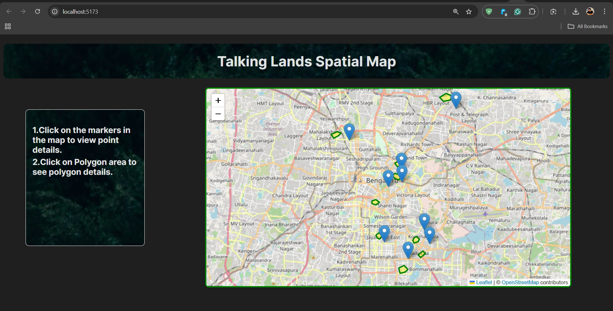

# TalkingLands Maps

TalkingLands Maps is a mapping application built using modern web technologies like Leaflet.js. It provides an intuitive and interactive way to explore geospatial data.



---

## Project Overview

This repository contains the source code for TalkingLands Maps. The project demonstrates interactive maps using **Leaflet.js** integrated with **Vite.js** for fast development and modern JavaScript support.

---

## Features

- Interactive maps with zoom and pan controls.
- Markers and Polygons for the location depiction.
- Lightweight and performance-optimized.

---

## Getting Started

### Prerequisites

Ensure you have the following installed:

- **Node.js**: Version 16 or higher
- **Git**: Latest version

---

### Steps to Clone and Run the Project Locally

1. **Clone the Repository**
   ```bash
   git clone https://github.com/RabbanMehamood/talkinglands-maps.git
   cd talkinglands-maps

2. **Install Dependencies**
   ```bash
   npm install
3. **Run Development Server**
   ```bash
   npm run dev
4. **Access the Application Open your browser and navigate to the URL provided in the terminal**
   ```bash
    http://localhost:3000

